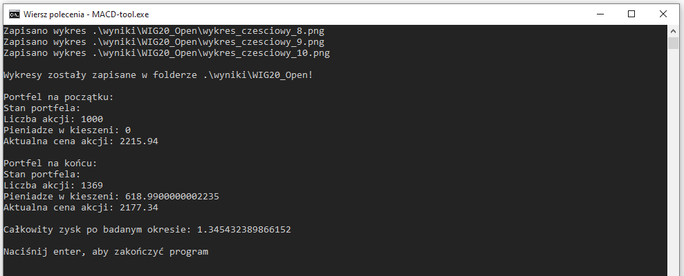

# Skrypt przetwarzający dane giełdowe

## Spis treści

1. [Opis](#opis)
2. [Wykresy generowane przez program - przykłady](#wykresy-generowane-przez-program---przyklady)
3. [Instrukcja uruchamiania](#instrukcja-uruchamiania)
4. [Menu aplikacji](#menu-aplikacji)


## Opis

Projekt z Metod Numerycznych - wyznaczanie wartości wskaźnika MACD na podstawie danych wejściowych z giełdy. Program przyjmuje dane o akcjach z giełdy (w formacie `.csv`, przykładowe pliki są w folderze `dane`), oblicza wskaźnik MACD i rysuje na tej podstawie wykresy zestawiające wartości wskaźnika i akcji. Algorytm przeprowadza również symulację obrotu akcjami i podejmuje decyzję o ich kupnie lub sprzedaży na podstawie wartości wskaźnika. Decyzje, jakie algorytm podjął, są również zaznaczane na wykresach, wraz z oceną ich opłacalności względem ostatniego zakupu - w postaci zielonego punktu, jeśli decyzja była korzystna lub czerwonego krzyżyka, jeśli nie była opłacalna.

Program może służyć jako proste narzędzie wspomagające, jeśli posiadamy dane o akcjach z pewnego okresu czasu wstecz i chcemy używać wskaźnika MACD do podjęcia decyzji o obrocie akcjami.

## Wykresy generowane przez program - przykłady

1. Wykres z całego badanego okresu (1000 dni):


2. Wykres szczegółowy, pokazujący wycinek czasu z badanego okresu (100 dni):


## Instrukcja uruchamiania

Można używać aplikacji na 2 sposoby:
- Pobrać i uruchomić gotowy plik wykonywalny aplikacji.
- Uruchomić jako skrypt w Pythonie.

1. Uruchamianie pliku wykonywalnego

Najnowsze wydanie narzędzia można pobrać [tutaj](./releases). Udostępniany jest plik wykonywalny oraz przykładowe dane do wypróbowania aplikacji. Aby uruchomić, wystarczy kliknąć 2-krotnie myszką na plik lub włączyć narzędzie CMD i wpisać 2 polecenia:
- `cd` oraz ścieżkę do pliku aplikacji np.:

```
> cd "C:\Users\UserName\Downloads"
```

- nazwę aplikacji i nacisnąć enter:

```
> MACD-tool.exe
```

Następnie należy zaczekać kilka sekund, aż pojawi się menu opcji (plik wykonywalny wygenerowany ze skryptów w Pythonie nie jest zbyt szybki).

2. Uruchamianie skryptu w Pythonie

Aby uruchomić program jako skrypt w Pythonie, należy pobrać pliki źródłowe projektu i upewnić się, że mamy zainstalowany interpreter języka Python lub go zainstalować. Następnie można:
- Otworzyć projekt w ulubionym IDE obsługującym projekty w Pythonie, np. PyCharm
- Lub skorzystać z narzędzia CMD. 

1. Otwierając projekt w IDE, zwykle wystarczy nacisnąć przycisk F5, aby uruchomić program.
2. Wybierając narzędzie CMD należy przejść w nim do głównego folderu aplikacji (tam, gdzie znajduje się plik `main.py`) i wpisać polecenie:

```
py main.py
```

## Menu aplikacji

Po uruchomieniu, wyświetli się menu aplikacji:


Aplikacja ma domyślne ustawienia dla ułatwienia jej przetestowania. Jeśli ich nie zmienimy i wpiszemy 'n', musimy jeszcze tylko upewnić się, że rozpakowaliśmy pobrany folder 'dane' i umieściliśmy go w tym samym folderze, w jakim znajduje się nasz plik wykonywalny lub w folderze głównym z plikami źródłowymi, jeśli uruchamiamy aplikację jako skrypt w Pythonie.

**Uwaga:** Proszę się upewnić, że folder z danymi rozpakował się do postaci './dane', a nie './dane/dane', ponieważ według domyślnych ustawień aplikacja sprawdza tylko pliki w najwyższym folderze 'dane'.

Po wpisaniu opcji 'n', wykresy dla domyślnych danych, czyli wartości otwarcia giełdy ('Open') znajdujących się w pliku `WIG20.csv`, zostaną wygenerowane i zapisane w folderze './wyniki'.

Jeśli chcemy podać inne dane wejściowe dla aplikacji, należy wybrać opcję 'T' - program zapyta wtedy o podanie nowej wartości dla każdej z 4 opcji do ustawienia:
- Ścieżka do folderu, w którym znajdują się dane - można podawać ścieżkę relatywną do folderu, w którym się znajdujemy, np. "./dane", lub absolutną, np. "C:\Users\UserName\Downloads"
- Nazwa pliku z danymi - plik z danymi należy umieścić w folderze, do którego ścieżkę wcześniej podaliśmy i wpisać tutaj jego nazwę, np. "WIG20.csv". Dane są w standardowym formacie, w jakim można je pobrać ze stron udostępniających archiwalne statystyki giełdowe, np. ze [stooq.com](https://stooq.com/db/h/).
- Którą grupę danych przeanalizować - dane giełdowe zazwyczają zawierają dane z kolumnami "Open", "High", "Low", "Close". Należy wpisać nazwę kolumny, którą chcemy poddać analizie i upewnić się, że nasze dane zawierają taką kolumnę.
- Ścieżka do folderu, w którym zapiszą się wyniki - podobnie jak w opcji ścieżki dla danych wejściowych, można podawać ścieżkę relatywną do folderu, w którym się znajdujemy, np. "./wyniki", lub absolutną, np. "C:\Users\UserName\Downloads". Zaleca się podać inną ścieżkę, niż ta, którą podaliśmy jako folder z danymi wejściowymi, aby generowane pliki wykresów nie nadpisały żadnych plików, które się znajdują w tym folderze z danymi wejściowymi.

Po wykonaniu się algorytmu i wygenerowaniu wykresów, wyświetli się podsumowanie przeprowadzonej symulacji:



Symulacja jest przeprowadzana z założeniem, że na początku posiadamy 1000 akcji. Na końcu obliczany jest zysk, jako stosunek wartości jaką obecnie posiadamy (ilość_akcji * cena + pieniądze_w_kieszeni) do wartości początkowej (ilość_akcji * cena).

Po wykonaniu symulacji możemy zobaczyć wygenerowane wykresy w folderze, ktory podaliśmy jako lokalizację do ich zapisu.

